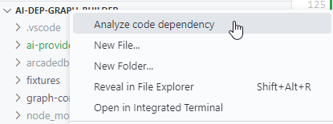
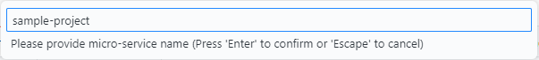
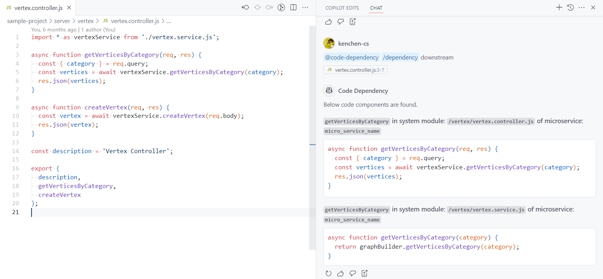
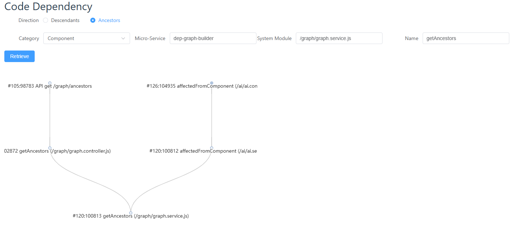

## Objective

Code dependency graph is always wanted, at least for me.

From Top-Down direction, it's great to know which parts of the system are needed to change when facing a business requirement change.  

From Bottom-Up direction, it's necessary to check which parts of the system might be impacted when one change is made.

Knowing code dependency can have better impact analysis and effort estimation.

This project is to build the code dependency graph with the asistance of AI.  Due to the dynamic characteristics of JavaScript, the dependency graph might not be completely accurate but we try to make it closed.


## Repo Components

This tool includes below major components:
- API for graph data (Node, Edge) manipulation against Graph Database  
  - Exported from `index.js`, mainly includes `GraphBuilder`, `AiProvider` and some facilitated APIs

- AI adaptors
  - Pre-defined `AiProvider` under directory `ai-providers`.

- AST parsers
  - Parsers for Java and JavaScript.

- Repo builders that build code dependency graph.
  - Sample Script `repo-builder.js` and a customized one `repo-builders/javascript.js` whichs handles JavaScript better and those speical `.routes.js` file in `sample-project`.

- Sample project providing restful API for graph component manipulation and visualization UI
  - Under directory `sample-project`.

- VSCode extension that can analyzes project and integrates with MCP server.
  - Under directory `vsc-extension`.

- MCP Server which retrieves Code Dependency from configured GraphDB based on provided code component.
  - `mcp-server.js`.


## Graph DB Setup - ArcadeDB

GraphDB is used for storing Code Components and Relationships.  Currently only supports ArcadeDB.

Start up DB through `download_start_arcadedb.bat` or `download_start_arcadedb.sh` to download and startup the ArcadeDB.  JDK 17 or above must exist.  Log file will be directed to `arcadedb.log`.

After startup, can access [ArcadeDB Studio](http://localhost:2480/) with `root/playwithdata`.  Please create a database, such as named `code` for below usage.


## Configuration for MCP Server and Code Analysis Script

Add `sample.config.js` like below:

```javascript
export default {
  graph: {
    type: 'ARCADEDB',
    connectionOptions: {
      host: '127.0.0.1',
      port: 2480,
      database: 'code',
      username: 'root',
      password: 'playwithdata'
    }
  },
  defaultAiProvider: 'MOONSHOT',
  // filesMatchingPatterns: /.*\.java$/,
  filesMatchingPatterns: [
    /.*\.(vue|js)$/,
    /^(?!.*\.(test|spec)\.js$)/,
    /^(?!.*\.json$).*$/,
    /^(?!.*(node_modules|cypress)).*$/
  ],
  aiProviders: {
    MOONSHOT: {
      apiKey: 'key-1'
    },
    BIGMODEL: {
      apiKey: 'key-2'
    }
  }
}
```


## Configure MCP Server in Cline/RooCode or other supported IDEs:

MCP server integrated into IDE allows AI to retrieve Code Dependency extracted and stored in GraphDB.

```json
{
  "mcpServers": {
    "code-dependency": {
      "command": "node",
      "args": [
        "/path/to/mcp-server.js"
      ],
      "env": {
      },
      "disabled": false,
      "autoApprove": []
    }
  }
}
```


## Code Analysis

### Use as VSC extension

Run command `vscode:package` to package vsix file to `./out/code-dependency.vsix` and install locally.

Configure extension properties with the same value from `sample.config.js`.  Difference is that the pattern in `filesMatchingPatterns` property of VSC extension has to be defined as String instead of RegExp.

Right click the root folder (where package.json or pom.xml is located), click the "Analyze code dependency" menu item, it will prompt the micro-service name to input before analyzing.





In VSC Copilot Chat, chat participant can be activated and retrieve code dependency for selected function using `@code-dependency /dependency [downstream/upstream/all]` (MCP Server Path `codeDependency.mcpServerPath` must be set in extension configuration)




### Run as Script

### Environment Variables

Some environment variables should be set before executing below script:
1. `PROJECT_ROOT`: Absolute path of the project to be analyzed.
2. `SERVICE_NAME`: Micro-Service Name of the project
3. `AI_ENABLED`: If set to `true`, it sends the function to AI provider to get description based on function implementation.


### Project Code Dependency Extraction

For JavaScript project, invokes command `node repo-builders/repo-builder.js`.  
For JAVA project, invokes command `node repo-builder.js`.  
  - `parsers/java.js` utilizes [LSP](https://microsoft.github.io/language-server-protocol/) besides AST.  You can start one using [Eclipse JDT](https://github.com/eclipse-jdtls/eclipse.jdt.ls).

These command extracts the code dependency on the project specified in path `PROJECT_ROOT` and store to your Graph DB.


## Code Dependency Retrieval from Graph DB

Beside using ArcadeDB's own console to run SQL or Gremlin language to retrieve code components and dependency.

Sample project has provided a simple UI to get code dependency.  It's under directory `sample-project` and can be started as:  

1. Run `npm install`
2. Run `npm build`
3. Run `node server.js`

Accessor `http://localhost:3000/` to get dependency through UI.




## Code Dependency Graph Design Explained

### Edge (Connection between Vertices)

There is ONLY one Edge type `Uses`.  It's used to connect:
- From Micro-Service to System Module
- From System Module to Component
- From Component to Component

A `Uses` B means that A `depends` on B, which is `A -> B`.  When this relationship exists, if B is updated, A is potentially affected.  Business Module, Micro-Service, System Module are mainly used as grouping purpose.  The real dependency or impact actually depends on `Component -> Component` relationship tracking.  Detail explanation of different Vertex categories is in following sections.


### Vertex (Node) categories in Dependency Graph

Vertex Schema
```javascript
{
  name: '', // Function Name / Field Name / API URL / Queue Name / Table Name / Store Procedure Name
  type: '', // `UI`, `Function` / `Field` / `Interface` (API / Queue / Table / Store Procedure) / `Config`, anything you want.
  visibility: '', // public / private / protected
  public: true/false, // Simple indicator to tell whether it's private, unaccessible outside
  description: '', // Generated from AI if it's Function
  microService: '',
  businessModules: [''], // Related Business Module that groups the Micro-Service if required.
  systemModule: '', // Node.js package name, JavaScript file name, Java Full-qualified Name, such as `user/user.controller.js`, `com.xxx.user.UserController.java`
  sourceCode: '', // Source Code of Function, mainly
  fileName: '', // Most of the time, it can possibly same as systemModule.  While say for JAVA, it could be different.
  language: '' // java, javascript, yml etc.
}
```

Vertex has three basic properties:
- `name`: Brief name of the Vertex and should be unique in same category
- `type`: Type identifier within same category if required.
- `description`: Long description of one Vertex.  It must be in detail, especially for Business Module, System Module, Function type Component, etc.  It is provided to AI as RAG with your question so that it can reason out which vertices to look up.

Vertex has four categories:
- Business Module
- Micro-Service
- System Module
- Component

#### Business Module (e.g. Organization, Vertex)

* Set to System Module as grouping purpose
* Should be correctly pinpointed by AI given BA’s question
* Used for top-down search all related System Module / Components


#### Micro-Service (e.g. sample-project)

* Technical Perspective
* Grouping purpose for better visualization or query


#### System Module (e.g. /vertex/vertex.routes.js)

Grouping code files by Roles or by Feature/Module are two popular choices.  This Dependency Graph project would prefer the second choice, but it does not affect your usage only if you name the Vertex in the pattern suits your project.  Name of the System Module Vertex could simply be the folder name, file name or the combination of it.

System Module Vertex has `businessModule` and `microService` properties for graph building.

By Roles:
```
│   ├── app.js
│       ├── controllers
│       │   ├── inquiryController.js
│       │   └── updateController.js
│       ├── dbaccessors
│       │   └── dataAccessor.js
│       ├── models
│       │   └── order.js
│       ├── routes
│       │   └── routes.js
│       └── services
│           └── inquiryService.js
```

By Feature/Module with optional sub-level roles' separation:
```
│   ├── app.js
│   ├── organizations
│   │   ├── organization.controller.js
│   │   ├── organization.routes.js
│   │   └── catalog.routes.js
│   └── orders
│       ├── controllers (optional separation)
│       │   ├── orderInquiryController.js
│       │   └── orderUpdateController.js
│       ├── dbaccessors
│       │   └── orderDataAccessor.js
│       ├── models
│       │   └── order.js
│       ├── routes
│       │   └── orderRoutes.js
│       └── services
│           └── orderInquiryService.js
```

#### Component

This is the actual Vertex that tracks code dependency.  It has extra properties beside `name`, `type`, `description`:

- `name`: It can be Function Name / Field Name / API URL / Queue Name / Table Name / Store Procedure Name
- `type`: It can be `UI`, `Function` / `Field` / `Interface` (API / Queue / Table / Store Procedure), etc.
- `public`: `true`/`false` indicating its public interface or not.
- `microService`: Part of the unique constraint of Component.
- `systemModule`: Part of the unique constraint of Component.  Easier CRUD and graph search starting point.
- `sourceCode`: Source code of this component.  It can be function signature & body, API route validation code, etc.


### Graph Building

To build a code dependency graph for a project, it should probably go through below steps:
- Create `Business Module` type Vertices.  These vertices should normally be prepared by business analysis and they probabaly cannot be done through codebase scan.
- Create `Micro-Service` type Vertices.  These vertices are normally 1-1 mapping to the code repositories.
- Create `System Module` and `Component` type Vertices.  These should be done automatically by code scan.
  - Execute `js.repo.graph.builder` or `java.repo.graph.builder`.


Sample Vertices:

```javascript
const businessModuleVertices = [
  {
    name: 'Organization',
    category: 'businessModule',
    description: 'Organization Management',
    type: 'Organization'
  },
  {
    name: 'Metering',
    category: 'businessModule',
    description: 'Metering Report',
    type: 'Reporting'
  }
];

const microServiceVertices = [
  {
    name: 'platform_console',
    category: 'microService',
    description: 'Platform Console',
    type: 'frontend'
  },
  {
    name: 'platform_console_service',
    category: 'microService',
    description: 'Platform Console Service',
    type: 'backend'
  }
];

const systemModuleVertices = [
  {
    category: 'systemModule',
    businessModules: ['Organization'],
    microService: 'platform_console_service',
    name: 'organization.routes.js',
    type: 'Class',
    description: 'API Routes for Organization API',
    dependencies: [
      {
        category: 'component',
        name: 'POST /organizations/:orgId/roles',
        type: 'api',
        description: 'API Routes for adding memberRoles for Organization',
        sourceCode: `...`
      }
    ]
  },
  {
    category: 'systemModule',
    businessModules: ['Organization', 'Metering'],
    microService: 'platform_console_service',
    name: 'organization.services.js',
    type: 'Class',
    description: 'Service Class for Organization',
    dependencies: [
      {
        category: 'component',
        name: 'addMemberRoles',
        type: 'function',
        description: 'Service API to add memberRoles for Organization',
        sourceCode: `...`
      }
    ]
  },
  {
    category: 'systemModule',
    businessModules: ['System'],
    microService: 'platform_console_service',
    name: 'repository.util.js',
    type: 'Class',
    description: 'Repository Utility',
    dependencies: [
      {
        category: 'component',
        name: 'updateAll',
        type: 'function',
        description: 'Repository API for updating data',
        sourceCode: `...`
      }
    ]
  }
];
```
